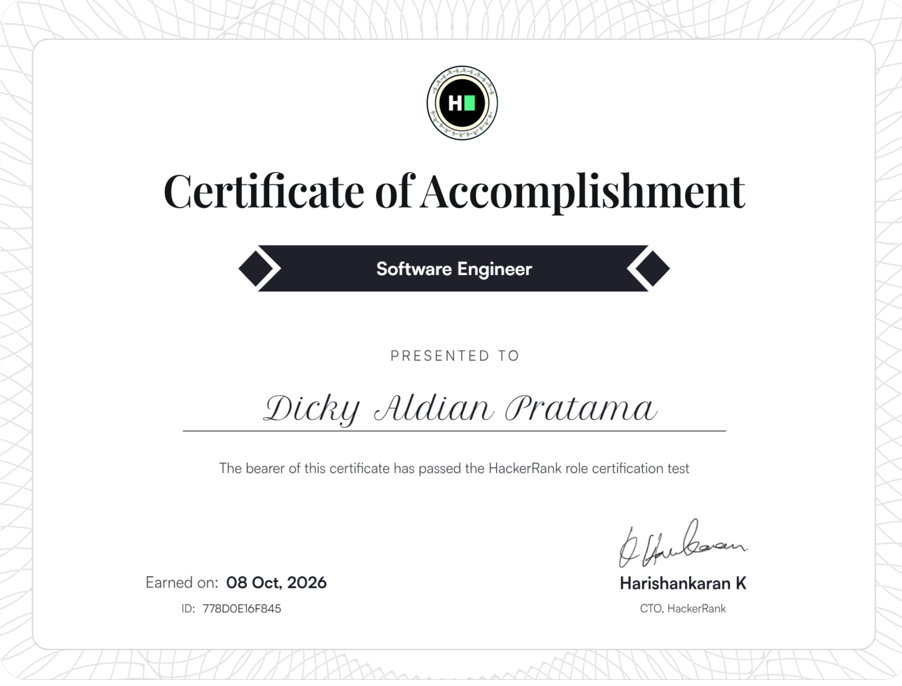
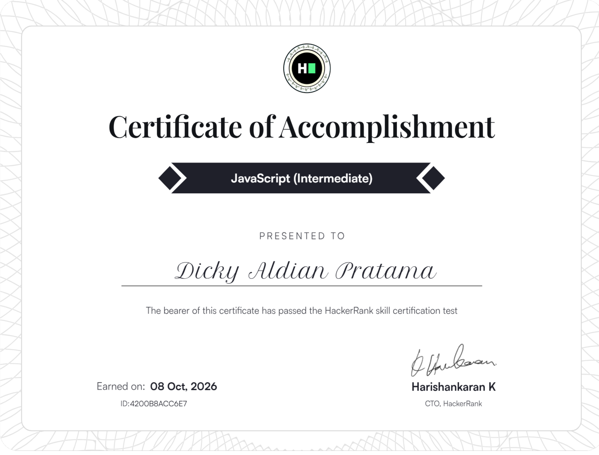
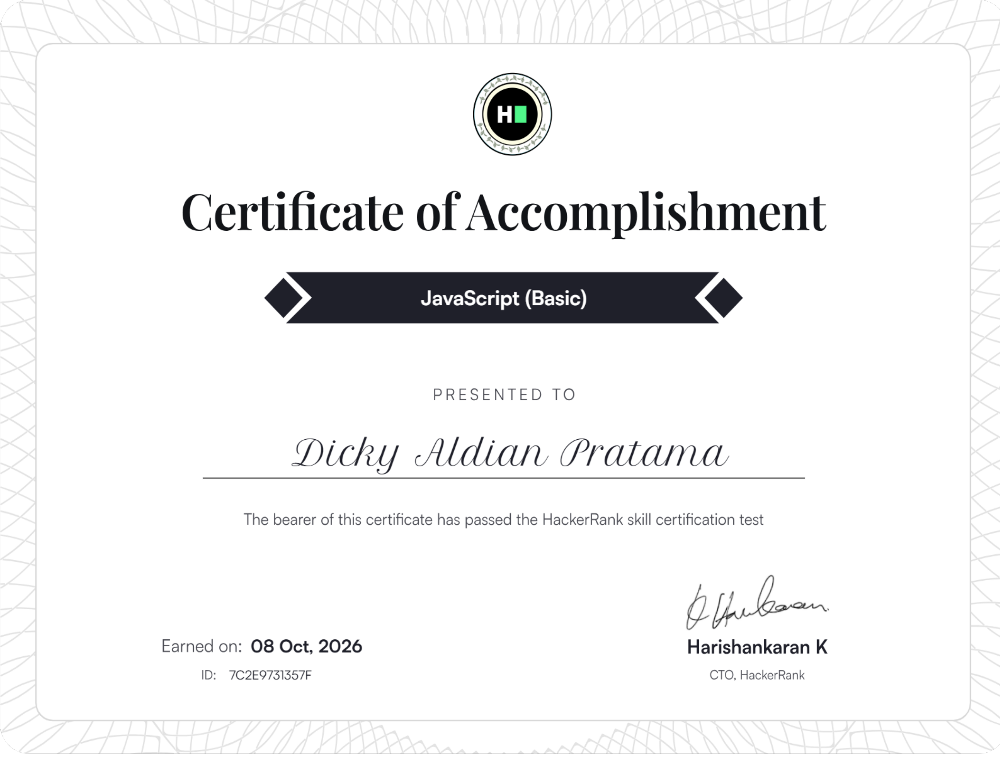
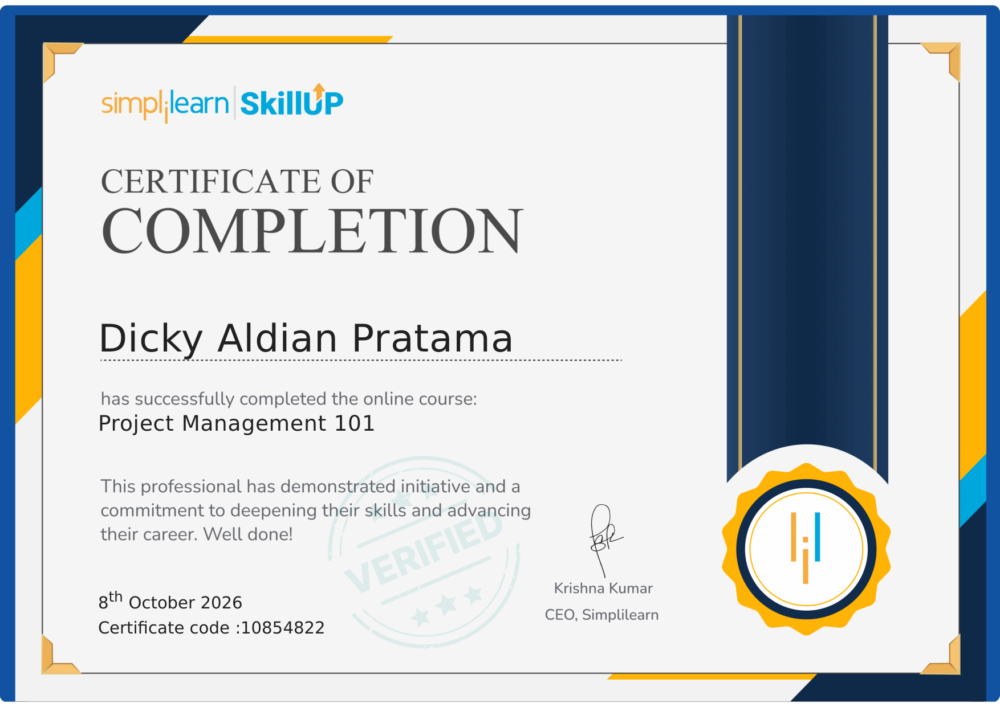
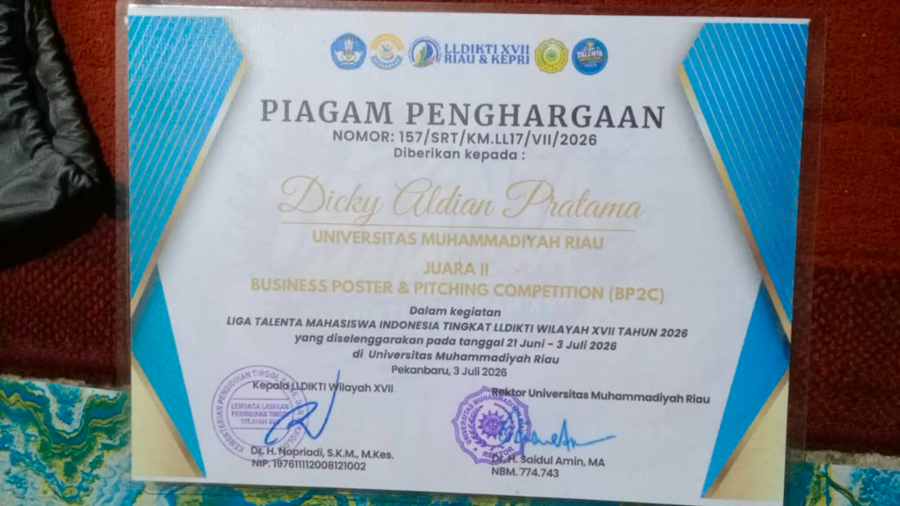
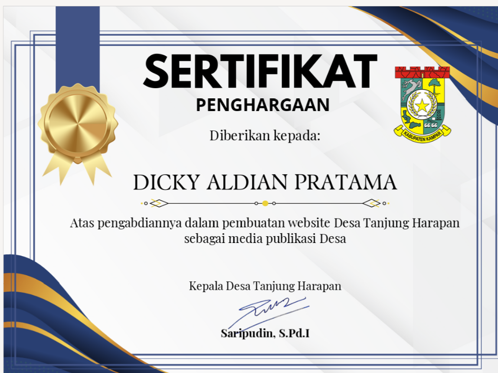
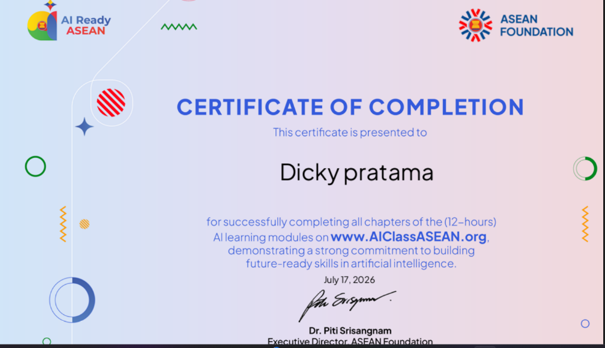
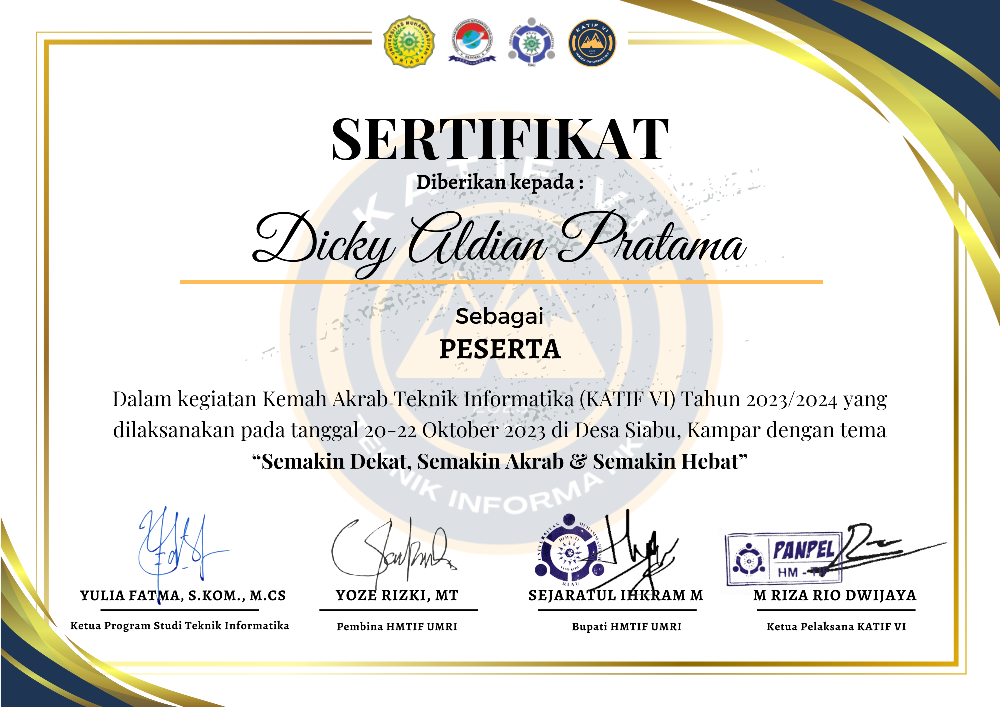
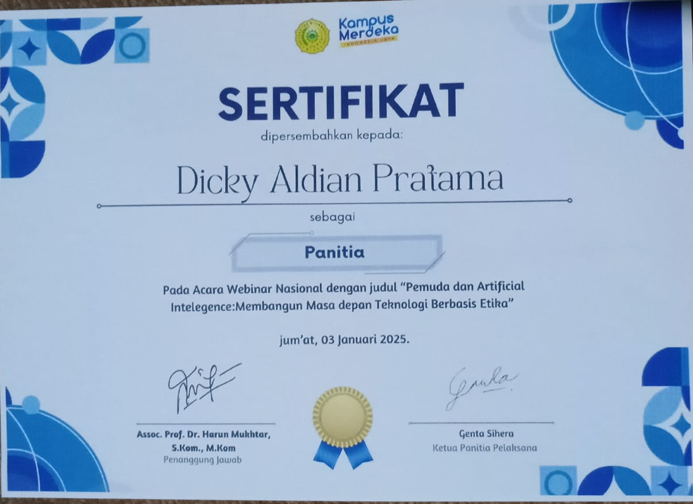
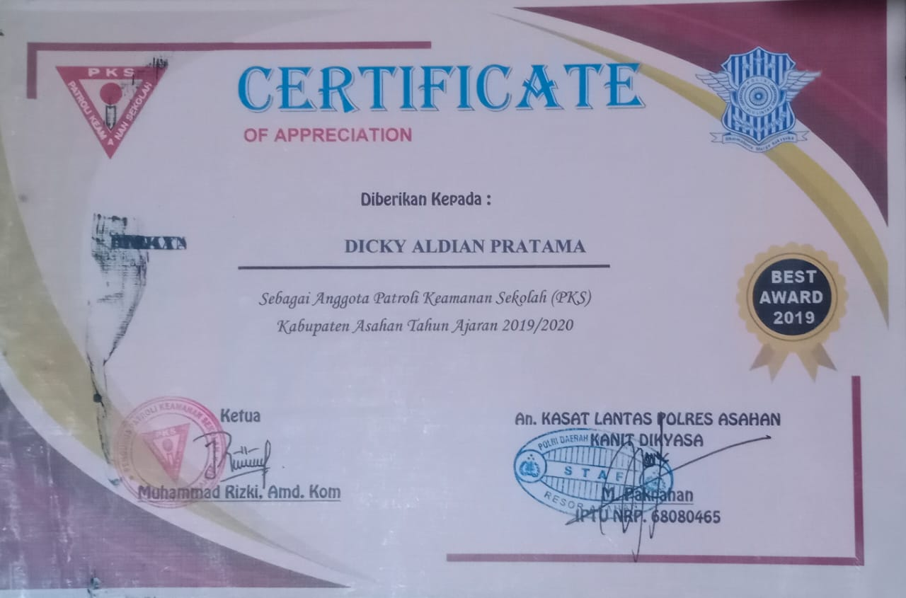

<h1 align="center">Dicky Aldian Pratama</h1>

<p align="center">
  <b>Software Engineer • Full-Stack Developer • Cloud & DevOps Practitioner</b><br>
  <sub>Backed by Scalable Backend Architecture, Cross-Platform Mobile, and Edge IoT Systems</sub>
</p>

<p align="center">
  
</p>

<p align="center">
  
  
  
  
</p>

<p align="center">
  <a href="mailto:bgdicky123@gmail.com"></a>
  <a href="https://wa.me/6283199116298"></a>
  <a href="https://instagram.com/aldianpratama"></a>
  <a href="https://github.com/dickyaldianpratama/web_portfolio"></a>
</p>

<br>

## About

I design and engineer production-grade software across the full development lifecycle — from database schema design and domain modeling to RESTful APIs, cross-platform mobile experiences, and automated continuous delivery. My core engineering focus centers on **full-stack web architecture**, **cloud-native containerization**, and **operational automation**.

That foundation is reinforced by hands-on experience in **embedded IoT firmware, network security analysis, and public-sector digital transformation** — because great software is not merely functional; it must be scalable, maintainable, secure, and delivered with disciplined rigor.

```
REQUIREMENTS → CLEAN ARCHITECTURE → API DESIGN → DATABASE ENGINE → DOCKER → CI/CD → DEPLOYED PRODUCT
```

I am a final-year Informatics Engineering student at **Universitas Muhammadiyah Riau (UMRI)**, focused on distributed enterprise systems, cloud automation, and modern software engineering practices.

<br>

## Current Focus

```text
Backend       → Laravel (Sanctum / Queue / REST), Django & FastAPI, .NET Core Web API, Node.js
Frontend      → Modern Responsive UI, React.js, Tailwind CSS, Component Architecture
Mobile        → Flutter & Dart, GetX reactive state management, offline-first & cloud sync
DevOps & CI   → Docker containerization, Docker Compose multi-service, GitHub Actions workflows
Cloud & Sys   → Nginx reverse proxy, Linux server administration, PostgreSQL & MySQL tuning
IoT & Edge    → ESP32/NodeMCU, embedded C/C++, MQTT telemetry protocols, sensor pipelines
Security      → Network traffic inspection (Wireshark/Nmap), TLS/HTTPS, vulnerability auditing
```

**Shipping / recently shipped**
```text
🌐  ProtoKarya Hub — One-stop IoT prototyping & sensor marketplace platform (LLDIKTI XVII BP2C 2nd Place)
🏛️  Tanjung Harapan Village Portal — Official public services & municipal publication website (Official Government Award)
🎫  Photobooth Queue & Payment System — Event ticketing web app with real-time payment polling & dynamic QR generation
📊  Enterprise Admin Dashboard — Token-secured management platform powered by Laravel Sanctum & GetX state control
☁️  Cloud-Integrated Media Gallery — Cross-platform Flutter mobile application with Google Drive API Service Account sync
🐳  Containerized CI/CD Suite — Automated test, build, and deployment pipelines using Docker, Nginx, and GitHub Actions
```

<br>

## Technical Expertise

<table>
<tr>
<td valign="top" width="50%">

**Backend & API Architecture**
- PHP & Laravel Framework: RESTful API design, Sanctum token authentication, Eloquent ORM, Blade, Composer
- Python Backend: Django, FastAPI, asynchronous workflows, Python automation scripting
- C# & .NET: ASP.NET Core Web API, object-oriented design, enterprise modular patterns
- JavaScript / TypeScript: Node.js, Express.js, middleware pipelines, JSON Web Tokens
- API Standards: REST, JSON specification, API authentication, webhook & polling architectures

**Database & Data Persistence**
- Relational Databases: MySQL, MariaDB, PostgreSQL, SQLite
- Database Design: Relational schema design, 3NF normalization, foreign key integrity
- Optimization: Indexing strategies, query execution profiling, transaction safety

**DevOps & Cloud Infrastructure**
- Containerization: Docker, Docker Compose multi-container staging, volume management
- CI/CD Pipelines: GitHub Actions automated linting, test suites, and remote deployment
- Web Servers: Nginx reverse proxy configuration, load balancing, SSL/TLS termination
- Operating Systems: Linux (Ubuntu/Debian), Bash scripting, SSH key management, process supervision

</td>
<td valign="top" width="50%">

**Mobile & Frontend Engineering**
- Mobile Multiplatform: Flutter & Dart (Android / iOS single codebase)
- State Architecture: GetX reactive state management, dependency injection, routing
- Mobile Integrasi: REST API consumption, local caching, WebView, Google Drive API
- Frontend Web: React.js, HTML5, CSS3, modern Vanilla JavaScript (ES6+)

**IoT, Hardware & Embedded Systems**
- Microcontrollers: ESP32, NodeMCU, Arduino development boards
- Embedded Languages: Embedded C/C++, Arduino framework
- Connectivity & Protocols: MQTT publish/subscribe, Wi-Fi networking, HTTP REST telemetry
- Sensor Integration: Environmental sensors, actuators, serial communication protocols

**Cybersecurity & Network Auditing**
- Traffic Inspection: Wireshark packet capture, protocol dissection, flow analysis
- Reconnaissance & Auditing: Nmap network scanning, port enumeration, vulnerability detection
- Transport Security: HTTPS/TLS certificate verification, DNS-over-TLS (DoT), MitM prevention
- Threat Mitigation: OWASP Top 10 awareness, parameterized queries, CSRF & XSS protection

</td>
</tr>
</table>

<br>

### Technical Maturity

```text
CORE
PHP (Laravel) · Dart (Flutter) · JavaScript · MySQL · Docker · Git / GitHub

APPLIED
Django · FastAPI · .NET Core Web API · Node.js · GitHub Actions CI/CD · Nginx · Linux CLI
GetX State Management · RESTful API Design · MQTT Protocol · ESP32 Embedded Systems
Network Inspection (Wireshark / Nmap) · Clean Architecture · Agile / Scrum Workflows

DEVELOPING
Kubernetes (k8s orchestration) · React.js · Cloud-Native Microservices · Advanced System Hardening
```

<br>

## Tech Stack

**Backend & Frameworks**


`Laravel` `Django` `FastAPI` `.NET Core` `Node.js / Express` `MySQL` `PostgreSQL` `SQLite` `RESTful API`

**Mobile & Frontend**


`Flutter` `Dart` `GetX` `React.js` `JavaScript (ES6+)` `TypeScript` `HTML5` `CSS3` `Tailwind CSS`

**DevOps, Cloud & System**


`Docker` `Docker Compose` `GitHub Actions` `Nginx` `Linux Ubuntu` `Bash CLI` `Git` `Kubernetes (basics)`

**IoT, Embedded & Hardware**


`ESP32` `NodeMCU` `Arduino` `Embedded C/C++` `MQTT Protocol` `Sensors & Actuators`

**Security & Analysis Tools**


`Wireshark` `Nmap` `Postman` `VS Code` `Android Studio` `Figma`

<br>

## Featured Projects

| Project | Description | Stack |
|---|---|---|
| 🌐 **[ProtoKarya Hub](https://github.com/dickyaldianpratama)** | Integrated web ecosystem for custom IoT engineering, hardware circuit design, and components marketplace. Winner of 2nd Place in Regional Business Pitching. | Laravel · Next.js / Blade · MySQL · ESP32 · MQTT |
| 🏛️ **[Desa Tanjung Harapan Portal](https://github.com/dickyaldianpratama)** | Official village administration web platform built to provide municipal transparency, official documentation publishing, and resident services. | Full-Stack Web · MySQL · Responsive UI · Linux VPS |
| 🎫 **[Photobooth Queue & Payment](https://github.com/dickyaldianpratama)** | Event registration platform engineered with real-time automated payment status polling and dynamic QR code generation. | Laravel · JavaScript · Payment API · QR Engine |
| 📊 **[Enterprise Admin Platform](https://github.com/dickyaldianpratama)** | Role-based data management dashboard utilizing token authentication and reactive state architecture for real-time CRUD operations. | Laravel Sanctum · Flutter / Web · GetX · REST API |
| ☁️ **[Cloud-Integrated Gallery](https://github.com/dickyaldianpratama)** | Cross-platform mobile gallery app consuming Google Drive API through server-side Service Account authentication. | Flutter · Dart · Google Drive API · Secure Storage |
| 🐳 **[CI/CD & Containerization Pipeline](https://github.com/dickyaldianpratama)** | Automated multi-stage Docker build pipeline paired with GitHub Actions for automated syntax validation, unit testing, and server delivery. | Docker · Docker Compose · GitHub Actions · Nginx |

<br>

## Achievements

| Award | Event / Issuer | Year |
|---|---|---|
| 🥈 **2nd Place — Business Poster & Pitching Competition (BP2C)** | Liga Talenta Mahasiswa Indonesia — LLDIKTI Region XVII (Riau & Kepri) | 2026 |
| 🏛️ **Official Community Service Honor (Village Web Platform)** | Village Government of Tanjung Harapan, Kampar Regency | 2026 |

<br>

## Certifications

<p align="center">
  <table>
    <tr>
      <td align="center" width="20%">
        <br/>
        <sub><b>Software Engineer</b><br/>HackerRank (ID: <code>778D0E16F845</code>)</sub>
      </td>
      <td align="center" width="20%">
        <br/>
        <sub><b>JavaScript (Intermediate)</b><br/>HackerRank (ID: <code>4200B8ACC6E7</code>)</sub>
      </td>
      <td align="center" width="20%">
        <br/>
        <sub><b>JavaScript (Basic)</b><br/>HackerRank (ID: <code>7C2E9731357F</code>)</sub>
      </td>
      <td align="center" width="20%">
        <br/>
        <sub><b>Project Management 101</b><br/>Simplilearn (ID: <code>10854822</code>)</sub>
      </td>
      <td align="center" width="20%">
        <br/>
        <sub><b>Juara 2 — BP2C (ProtoKarya)</b><br/>LLDIKTI Wilayah XVII & UMRI</sub>
      </td>
    </tr>
    <tr>
      <td align="center" width="20%">
        <br/>
        <sub><b>Website Desa Tanjung Harapan</b><br/>Pemerintah Desa Tanjung Harapan</sub>
      </td>
      <td align="center" width="20%">
        <br/>
        <sub><b>AI Ready ASEAN (14 Modules)</b><br/>ASEAN Foundation & Google.org</sub>
      </td>
      <td align="center" width="20%">
        <br/>
        <sub><b>Kemah Akrab Informatika (KATIF VI)</b><br/>HMTIF UMRI</sub>
      </td>
      <td align="center" width="20%">
        <br/>
        <sub><b>Data Science Seminar</b><br/>Informatics Academic Forum</sub>
      </td>
      <td align="center" width="20%">
        <br/>
        <sub><b>Leadership & Organization</b><br/>PKS MAN Asahan</sub>
      </td>
    </tr>
  </table>
</p>

<br>

## GitHub Statistics

<p align="center">
  
  
</p>

<p align="center">
  
</p>

<p align="center">
  
</p>

<br>

## Engineering Goals

- Architect and deploy scalable backend microservices that handle high concurrency with predictable latency
- Deepen production container orchestration practices with Kubernetes (k8s) and automated canary releases
- Expand edge computing telemetry integrations connecting distributed IoT sensors with cloud analytics backends
- Strengthen static application security testing (SAST) and automated vulnerability auditing inside CI/CD workflows
- Deliver impactful software engineering solutions with clean architecture, robust tests, and disciplined documentation
- Actively contribute to open-source developer tooling and developer communities

<br>

<p align="center">
<i>"Resilient software is not built by chance — it is forged through clean architecture, continuous automation, and uncompromising discipline."</i>
</p>

<p align="center">
  <sub>Dicky Aldian Pratama · Informatics Engineering, Universitas Muhammadiyah Riau · Indonesia</sub>
</p>
